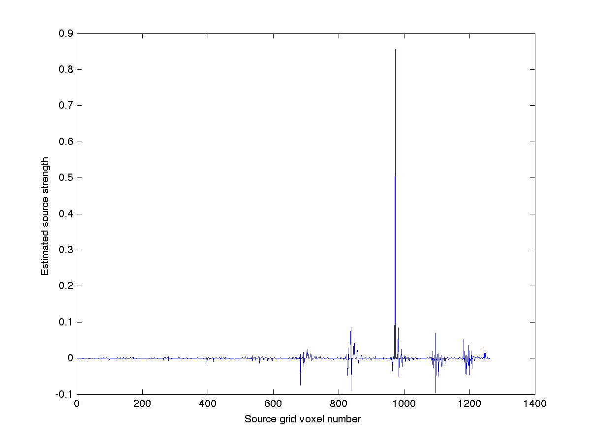
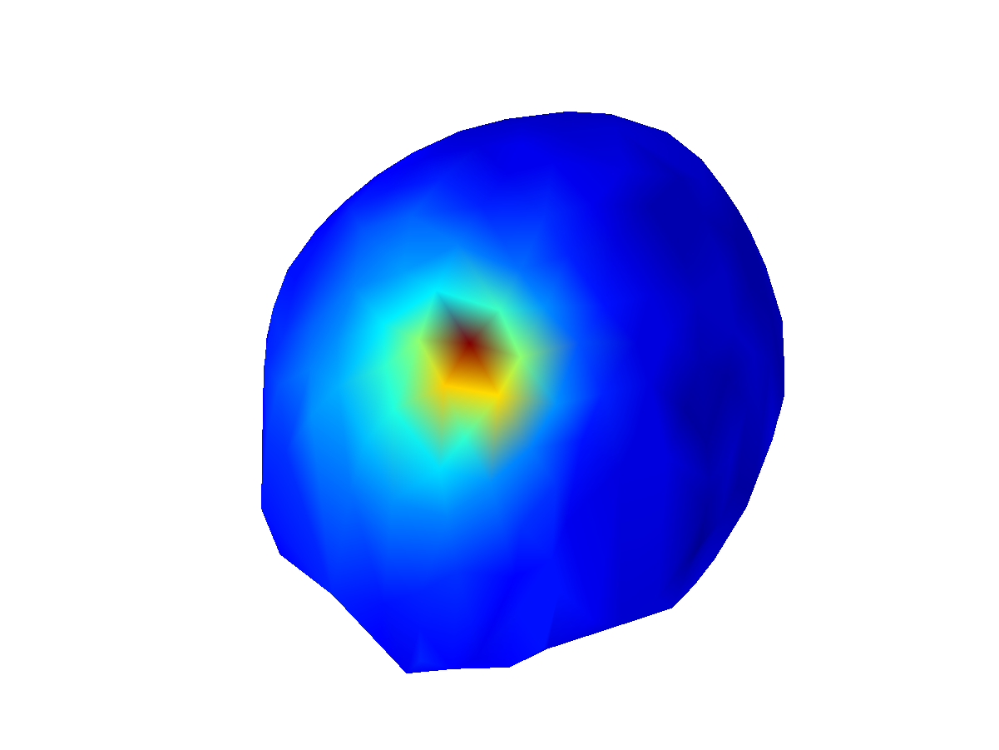
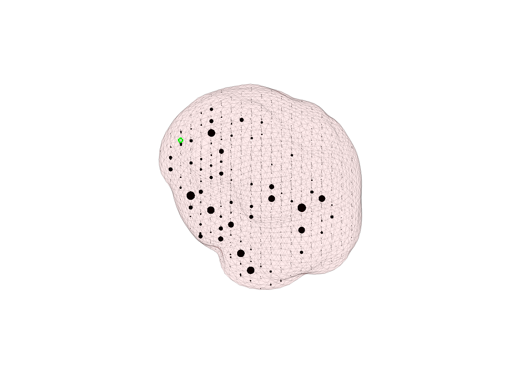
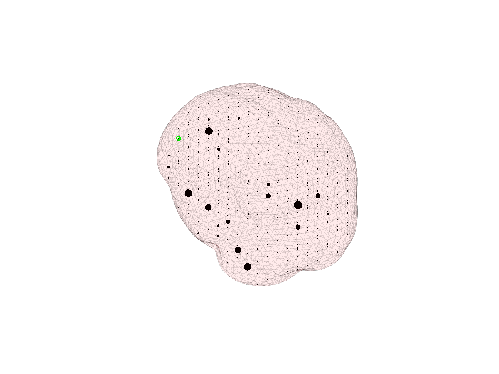

Part III: Localizing EEG sources
============

[[Parent]]: tutorial_dipoles.txt

In this last part of the tutorial we will attempt to solve the 
_EEG inverse problem_. That is, given a distribution of scalp 
potentials we will attempt to localize the underlying EEG sources. In fact
this is just one part of the inverse solution. The full solution involves also
the reconstruction of the temporal activation of the underlying EEG sources. 
However, we will leave that for a [future tutorial][tutorial_connectivity] where
our EEG sources will have time-varying activation patterns. 

[tutorial_connectivity]: http://kasku.org/tutorials/connectivity

In this last part of the current tutorial you may use some the sources that you generated
in  [Part II][part2] or you may as well generate new sources altogether. I will
follow the latter approach. If you decide to use new sources then you should 
first remove the old ones (I am assuming you generated only 5 sources):

````matlab
myHead = remove_source(myHead, 1:5);
````

[part2]: ./eeg_sources.md

## Localizing a single dipole

Let's generate a radial and superficial dipole:

````matlab
myHead = add_source(myHead, 'Name', 'radial', 'strength', 1, ...
	                        'MaxDepth', 10, 'Angle', 0)
close all;
figure;
plot_source_leadfield(myHead, 1, 'momemtum', 50)
````
	
Now let's plot the scalp potentials that we would measure in such a
single dipole scenario:

````matlab
figure;
plot_scalp_potentials(myHead, 'time', 1)
````
	
The result is shown below.


	
As we have a single EEG source and there is no noise, the distribution of scalp potentials
(what we are measuring) is identical to the leadfield generated by the only
underlying EEG source (what we need for source localization). This is
obviously an ideal scenario and we would expect to be able to solve the inverse
problem accurately. Let's try:

````matlab
myHead = inverse_solution(myHead);
figure;
plot_inverse_solution_dipoles(myHead, 'time', 1);
````

The first command above will estimate the location of the source using a
Minimum Norm Estimate (MNE), which is the method employed, for instance, by
the [MNE software][mne]. The generated figure is shown below:

[mne]: http://www.nmr.mgh.harvard.edu/martinos/userInfo/data/MNE_register/

 and the true localization of the underlying dipole (green empty marker)")


Although you can barely see it in the figure above, the inverse solver estimated 
non-zero (but very small) activation strengths not only at the true location of the
dipole, but also at many other locations of the source grid. You can actually inspect the
activation values that were estimated at each source voxel with the commands:

````matlab
close all;
figure;
plot(1:myHead.NbSourceVoxels, myHead.InverseSolution.strength);
xlabel('Source grid voxel number');
ylabel('Estimated source strength');
````

which, in my case, looks like this:



	
Indeed, the only source grid location at which the strength is significantly 
different from zero is voxel 245, which is also the location of the true
underlying dipole :

````matlab
myHead.Source(1)

ans = 

           name: 'radial'
       strength: 1
    orientation: [0.5630 0.8133 0.1466]
          angle: 0
            pnt: 245
       momemtum: [0.5630 0.8133 0.1466]
     activation: 1
````


In your case, the location of the underlying dipole is likely to be different but, if the
inverse solver did its job, then `myHead.Source(1).pnt` should match the location of the
maximum of `myHead.InverseSolution.strength`. Let your tutor know it that is not the case!
	
## Measurement Noise	
	
 To make our simulations a bit more realistic, we will add a bit of measurement noise:

````matlab
myHead = add_measurement_noise(myHead, 0.00001);
````

 Now let's compare the source leadfield with the (noisy) measured scalp potentials:
	
````matlab
close all;
figure;
plot_source_leadfield(myHead, 1, 'momemtum', 25);
set(gcf, 'Name', 'Source leadfield');
figure;
plot_scalp_potentials(myHead, 'time', 1);
set(gcf, 'Name', 'Measured scalp potentials');
````
	
The two resulting figures are shown below:




	

As you can see the distribution of scalp potentials is (to the naked eye) identical to
 the source leadfield. Indeed the measurement noise is extremely low in our example. 
 But let's try to localize the underlying source:

````matlab
myHead = inverse_solution(myHead);
figure;
plot_inverse_solution_dipoles(myHead, 'time', 1);
figure;
plot_inverse_solution_dipoles(myHead, 'time', 1, 'exp', 4);
````
	
The latter command will use a higher weighting exponent for the plot so
that stronger voxel activations will appear even stronger and weak 
activations will look even weaker. The resulting figures are shown 
below:





Let's also plot the estimated dipole strength at each source location, in a 2D plot:

````matlab
close all;
figure;
plot(1:myHead.NbSourceVoxels, myHead.InverseSolution.strength);
xlabel('Source grid voxel number');
ylabel('Estimated source strength');
````

As you can see, the inverse estimate is completely wrong now. How is this possible, 
even if the scalp potentials were only marginally disturbed by noise? What would you 
do to try to overcome this problem?


## Ill-conditioning

If you didn't guess it, the inverse estimate obtained from our noisy 
measurements was so poor because the leadfield matrix (i.e. the matrix of
coefficients that maps current sources to potential differences at the 
scalp) was ill-conditioned. By ill-conditioned we mean that we cannot 
directly calculate an accurate pseudoinverse of the leadfield matrix. 
Recall from the slides on [linear algebra][linear_algebra_slides] that the
 pseudoinverse ''A^+'' of leadfield matrix ''A'' is defined as:

[[Equation]]: A^+ = (A^T*A)^{-1}A^T


[linear_algebra_slides]: https://dl.dropbox.com/u/4479286/linear_algebra.pdf


The problem here is that the term ''A^T*A'' is not invertible, due to some 
columns of ''A'' being very close to linearly dependent. You can check the
conditioning of a matrix using MATLAB's command `cond()`. Let's check the
condition number of our leadfield matrix:

````matlab
cond(myHead.SourceDipolesLeadField)

ans =

   1.2686e+16
````


Remember from the [documentation][cond_doc] of the `cond()` command that, 
the larger the condition number, the worse the conditioning of the matrix 
is. In our case, we obtained a very large number, clearly indicating that, 
even if we still can compute the pseudoinverse, using it to recover the 
source dipoles magnitudes might lead to inaccurate results, especially in 
the presence of noise.

### Regularization

As you learned from the course lectures, a way to deal with ill-conditioned
inverse problems is to use [regularization][regularization]. Method 
`inverse_solution()` allows you to define a regularization parameter 
''\lambda'' to be used when computing the pseudoinverse of the leadfield:

````matlab
myHead = inverse_solution(myHead, 'Lambda', 0.0001);
figure;
plot_inverse_solution_dipoles(myHead, 'time', 1);
````

How does the inverse solution look like now? Play around with the 
regularization parameter (and maybe with the level of measurement noise) 
and tell your tutor what you learned. 


[cond_doc]: http://www.mathworks.nl/help/matlab/ref/cond.html
[regularization]: http://en.wikipedia.org/wiki/Tikhonov_regularization